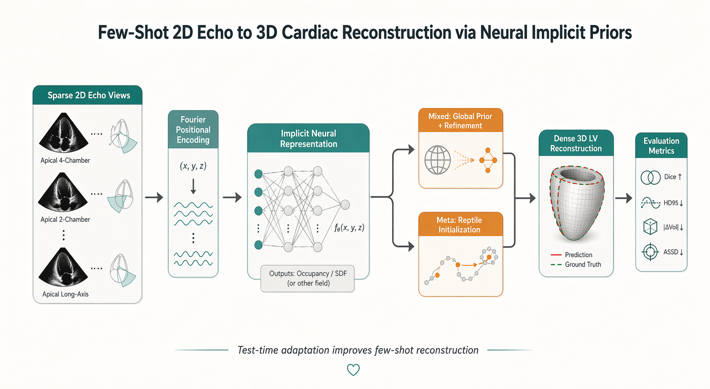

# Few-Shot 2D Echo to 3D Cardiac Reconstruction via Neural Implicit Priors
Final project for `16825 Learning for 3D Vision`

This repository contains the code, saved artifacts, and reproduction instructions for reconstructing 3D left-ventricle shape from sparse 2D echocardiographic slices using neural implicit representations.

<p align="center">
  
  
  
  
</p>

<p align="center">
  <a href="https://tushar-nayak.github.io/cardiac-volume-reconstruction/" style="display:inline-block;padding:10px 16px;border:1px solid #111;border-radius:999px;text-decoration:none;color:#111;font-weight:600;">
    Interactive Results
  </a>
</p>

<p align="center">
  
</p>

Start with:

- [Setup](#setup)
- [Recommended commands](#recommended-commands)
- [Project structure](#project-structure)
- [Dataset layout](#dataset-layout)
- [Reproducibility](REPRODUCIBILITY.md)
- [Usage guide](docs/USAGE.md)
- [Results index](results_index.md)

## Summary

This project reconstructs 3D left-ventricle geometry from sparse 2D echocardiographic slices using a coordinate-based implicit neural representation.

The main comparison is between:

- `Mixed`: transfer learning from a shared prior, followed by test-time refinement
- `Meta`: Reptile-style meta-learning optimized for fast adaptation

The strongest adapted result in the saved summaries is the meta-learned model on the healthy end-diastole setting, with 3D Dice `0.8638` and 3D IoU `0.7649`.

For the full report, see [`report.md`](report.md).

## What This Repo Does

- Learns a continuous 3D cardiac occupancy field from sparse 2D echo views.
- Compares a shared global prior against a meta-learned initialization for fast adaptation.
- Publishes interactive 2D/3D visualizations and tracked result summaries for inspection.

## Best Interactive Results

- [Live site](https://tushar-nayak.github.io/cardiac-volume-reconstruction/)
- [Best mixed 3D mesh](https://tushar-nayak.github.io/cardiac-volume-reconstruction/checkpoints/html_visualizations/MITEA_107_scan1_ED.nii_mixed_3d_mesh.html)
- [Best mixed 2D slices](https://tushar-nayak.github.io/cardiac-volume-reconstruction/checkpoints/html_visualizations/MITEA_107_scan1_ED.nii_mixed_2d_slices.html)
- [Best refined meta mesh](https://tushar-nayak.github.io/cardiac-volume-reconstruction/checkpoints3/html_visualizations3/MITEA_107_scan1_ES.nii_mixed_refined_3d_mesh.html)

## Key Results

The saved test-split summaries report:

| Method | 3D Dice (full) | 3D IoU (full) |
|---|---:|---:|
| Mixed stratified ED-healthy | 0.8491 ± 0.0593 | 0.7422 ± 0.0866 |
| Meta after refinement | 0.8638 ± 0.0599 | 0.7649 ± 0.0893 |
| Mixed, no stratifiers | 0.8643 ± 0.0605 | 0.7658 ± 0.0904 |

The best full-volume overlap in the saved summaries is the mixed model without stratifiers, while the meta-learned initialization remains the strongest adapted stratified result.

## What’s here

- `cardiac_reconstruction/` is the polished command surface. Use `python -m cardiac_reconstruction ...` for the canonical workflows.
- `src/minimal_starter_5.py` remains the canonical prototype pipeline and shared utility module.
- `src/run_all.py` runs the main stages sequentially.
- `src/ablation_studies_7.py` runs a small, self-contained ablation sweep.
- `src/sparse_reconstruction_2.py` performs sparse-view reconstruction and saves mesh/grid outputs.
- `src/complete_pipeline.py` combines sparse reconstruction and 3D viewer generation.
- `src/viewer_3d_reconstruction_2.py` builds interactive HTML viewers for existing reconstructions.
- `src/data_inspector.py` checks the dataset layout and prints scan statistics.
- `old/` contains earlier iterations and implementation notes.

## Project Structure

```text
cardiac_reconstruction/   Canonical package entrypoints and stable imports
src/                      Working prototype scripts and experiment variants
old/                      Archived iterations and development history
docs/                     Usage notes
report.md                 Final write-up with the reported results
results_index.md          Tracked artifact index for the documented outputs
REPRODUCIBILITY.md        Exact commands / config needed to rerun the reported results
```

The new package layer gives you a clean way to run the project without changing the original scripts:

```bash
python -m cardiac_reconstruction inspect
python -m cardiac_reconstruction baseline
python -m cardiac_reconstruction sparse
python -m cardiac_reconstruction viewer
python -m cardiac_reconstruction all
```

## Requirements

The code is written for Python 3.11+ and uses PyTorch with GPU acceleration when available.

Core dependencies used across the active scripts:

- `torch`
- `numpy`
- `matplotlib`
- `nibabel`
- `scipy`
- `plotly`
- `scikit-image`

Optional dependencies used by some historical or experimental scripts:

- `wandb`
- `trimesh`
- `pandas`
- `seaborn`
- `h5py`
- `pytorch3d`

## Setup

If you prefer a pinned dependency file, use `requirements.txt` for pip or `environment.yml` for Conda.

```bash
conda env create -f environment.yml
conda activate cardiac-3d
```

If you prefer pip, create an environment first and then run `pip install -r requirements.txt`.

If you need a specific CUDA build of PyTorch, install that build first and then install the rest of the dependencies.

If you plan to use scripts that rely on `pytorch3d`, install it separately following the official PyTorch3D instructions for your CUDA / PyTorch version.

## Dataset layout

The active code expects the MITEA dataset to be organized as:

```text
<data_path>/
  images/
    *.nii or *.nii.gz
  labels/
    *.nii or *.nii.gz
```

By default, `src/minimal_starter_5.py` points to:

```python
Path(__file__).resolve().parents[1] / "cap-mitea" / "mitea"
```

If your dataset lives elsewhere, update `CONFIG['data_path']` in `src/minimal_starter_5.py`. Most other scripts import that same config.

### Dataset Citation

If you use MITEA in your own work, cite:

Zhao D, Ferdian E, Maso Talou GD, Quill GM, Gilbert K, Wang VY, Babarenda Gamage TP, Pedrosa J, D'hooge J, Sutton TM, Lowe BS, Legget ME, Ruygrok PN, Doughty RN, Camara O, Young AA and Nash MP (2023) MITEA: A dataset for machine learning segmentation of the left ventricle in 3D echocardiography using subject-specific labels from cardiac magnetic resonance imaging. Front. Cardiovasc. Med. 9:1016703. doi: 10.3389/fcvm.2022.1016703

## Recommended commands

1. Inspect the dataset before running anything else.

```bash
python -m cardiac_reconstruction inspect
```

2. Run the main reconstruction pipeline.

```bash
python -m cardiac_reconstruction baseline
```

3. Run the full staged workflow.

```bash
python -m cardiac_reconstruction all
```

The legacy `src/run_all.py` still works and will ask for confirmation before launching the staged experiments.

## Output directories

The repository creates several on-disk result folders:

- `checkpoints/`
- `ablation_results/`
- `sparse_reconstruction_results/`
- `3d_comparison_viewers/`
- `3d_comparison_viewers_v2/`
- `pipeline_results/`
- `wandb/` if Weights & Biases logging is enabled

These paths are ignored by git.

## Versioned Results

Text-based result snapshots from the current runs are kept in git so the documented outputs stay visible:

- `sparse_reconstruction_results/*.json` for per-subject reconstruction metadata
- `3d_comparison_viewers_v2/*.html` for interactive comparison viewers

The corresponding NIfTI volumes remain untracked because they are large binary artifacts.

See [results_index.md](results_index.md) for the current tracked snapshot list.
The GitHub Pages site is published from the `gh-pages` branch, while `main` stays source-only.

## Notes on the codebase

- The project went through several iterations; the active scripts in `src/` are the ones to use first.
- `old/` preserves earlier versions and implementation notes, which are useful for archaeology but not the recommended execution path.
- Files with suffixes like `_fixed`, `_optimized`, `_multicore`, or `FINAL_*` are alternative experiment variants and not the canonical starting point.
- The code is optimized for experimentation, not for a polished research release. Expect hard-coded paths and dataset assumptions in some scripts.
- See [docs/USAGE.md](docs/USAGE.md) for a more complete script-by-script usage guide.
- If you want a stable import path from Python, use `import cardiac_reconstruction`.

## Troubleshooting

- If a script says no subjects were found, check that your dataset has `images/` and `labels/` folders and that filenames match by stem.
- If you get CUDA errors, the code will fall back to CPU where possible, but runs will be much slower.
- If `plotly` HTML viewers are generated but do not open correctly, try opening the `.html` files directly in a browser rather than through an IDE preview.
- If you change the dataset location, update the config in `src/minimal_starter_5.py` first.

## License

MIT License. See [LICENSE](LICENSE).
